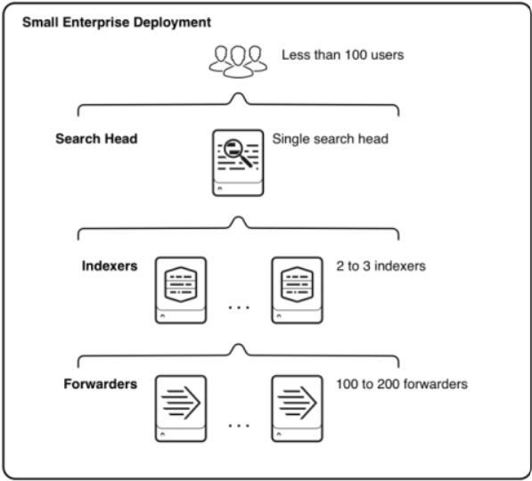

## System Architecture

There are three (3) main components of Splunk System Architecture 1.) Forwarders, 2.) Indexers and 3.) Search Heads. Splunk Enterprise Forwarders and Indexers are software instances of the software that performs specialized task, like indexing and forwarding data to third-party systems. There are several other components that match these types of tasks in a deployment and they fall into two broad categories; Processing and Management Components. **Processing components** handle data while **Managing components** support activities of the processing components. There are three types of processing components: 

1. Forwarders
2. Indexers
3. Search Heads

**Forwarders**, ingest raw data and forwards the data to another component such as another Forwarder or an indexer.

**Indexers**, index and store data but they can also search data. They usually reside on a dedicated machine. They can be independent or in clusters (peer nodes or index clusters). A cluster is a physical grouping of machines in a collection in a particular region like Africa, Asia or North America.

**Search Heads**, is where Technical Analysts will likely spend most of our time. They handle search requests from users and distribute the requests across indexers, which search their local data. They can be independent or in a search cluster or pool. They help us to consolidate the results from all of the indexers and serve the results to the users. The search head provides the user with dashboards, reports and alerts that can be triggered on defined threshold. They usually sit on dedicated Servers as independent search heads, or they can be in an indexer cluster, or search head pool. See the following diagram that shows how the Search Head represents a small enterprise with less than 100 users. 

### Understanding the underlying systems Splunk is monitoring

**What is Unstructured Data?** Unstructured data is data that is not in rows or columns. It is hard to read and manipulate the data and even harder to make sense of what might be in the dataset. These are normally log files or event logs on a system or web server. The following image shows an example of unstructured data from a WebLogic server. When an error occurs, developers will login to the server search through log files to find the error that was reported. These server logs and be large and difficult to read and have many other errors that we are not looking for but will need to review to be sure that it is in fact, not the error we are searching for during our trace. Large organization have hundreds or thousands of servers determine by the company and business type. Without Splunk, developers could spend days or weeks searching files for errors. There are many tools we can use to help with debugging and searching log files and traceability. Splunk solves this search problem by structuring our data in a readable format. 

From the image above is really difficult to determine if there is a problem just viewing the logs. We would need to look closely at all the output to determine a reported problem or copy the output to a different editor. Alternately, we could copy the data to our local machine however, this would be time consuming because these files are large (i.e., 20-50GB) and will need to travel over the organizations network from the company server to your local machine. Now, imagine that we have one-hundred (100) servers and that we manage and all with their own unique problem/error codes. This becomes a major problem that no one wants to deal with on a daily basis. This is one of the problems Splunk solves by bringing structure to unstructured data. 

**What is Structured Data**? Structured data is the opposite of unstructured data and represents a clearer picture for us to read, work with and analyze. It can be presented in rows and columns (tables or tabular data) and normally comes from a web servers or event logs. Taking a look at the screenshot below, you’ll notice a field **status: 200** This is a common field that is an indicator that a webpage was returned to the user successfully. Other status codes like 400/500 series show us which pages did not return successfully. We can easily read a lot of the metadata about the request and response of the page using Splunk to identify problems quickly. Additionally, we could create dashboard and view failed request over a specific time periods or view spikes in web traffic or CPU utilizations and memory usage. Taking this a step further, we can send notification at defined thresholds for CPU, Memory usage, repones latency and more.  

{}
**Note**: HTTP/HTTPS response codes tell us if a particular request failed or was successful. This topic is outside of the scope of this book but should be reviewed at some point in your technical journey.   
{}

 

### Splunk Documentation

**Splunk Documentation** has two main platforms under the Splunk umbrella; Splunk Enterprise and Splunk Cloud. Based on the product we have installed the documentation will be different. **Splunk Cloud** provides insights for data at the petabyte-scale and data analytics across a hybrid cloud solution. **Splunk Enterprise** allows us to search, analyze and visualize data for actionable insights from all of your data within the enterprise. 

### Splunk Community 

The [ Splunk community ](https://www.splunk.com/en_us/community.html) has three (3) parts, *Splunk Answers*, *Splunk User Groups* and *Splunk Ideas*. **Splunk Answers** is a forum style questions and answer platform that we can read, post and respond to question. If we are working with search syntax and we are not getting the expected results, Splunk Answers is platform to find solutions and leverage the community of passionate experts. **Splunk User Group** allows us to meet the super fans of the software online or in person. It's an environment where we can go to learn tips and tricks and how others are using Splunk in their day-to-day business. **Splunk Ideas** gives us the option to search for ideas to improve the platform and vote or submit an idea for new features and enhancements to product. We can always leverage software communities to help and guide our solutions to problems we face. Remember, if you encounter a problem(s), there's likely someone else that had this issue too. The best place to start looking is the community. 

