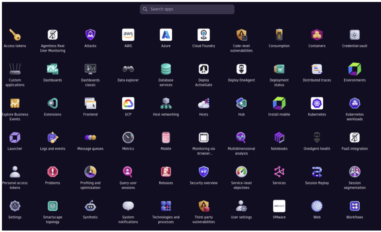

Here is the corrected content with grammar and punctuation improvements:

## Intro to Dynatrace

What is Dynatrace? Dynatrace is an analytics and automation provider for unified observability and security. The Application Performance Monitoring (APM) feature provides automated, code-level visibility and transactional context for complex enterprise applications. It can detect and monitor microservices across hybrid environments, which include servers that are on-premises and in the cloud. We can also manage and analyze log files on connected devices to troubleshoot reported issues. With Log Management and Analytics, we can explore millions of log files across the enterprise with a single application interface. Similar to Splunk, Dynatrace has its own query language, Dynatrace Query Language (DQL), for querying data and viewing results.

Dynatrace offers a rich feature set that we can deploy to align our observation strategies with practical and actionable business intelligence. Below is a list of features Dynatrace offers, along with a screenshot of a more detailed list of features to give you an idea of the tool's capabilities. We will focus on four key areas highlighted in the list below:

* **Digital Experience Monitoring**
* **Business Intelligence**
* Automation
* **Infrastructure Monitoring**
* Log Analytics
* Application Performance Monitoring (APM)
* **Application Security (AppSec)**

## Dynatrace Documentation
[Dynatrace Support](https://www.dynatrace.com/support/help) is a general area of interest worth exploring to discover how the platform operates. It outlines how to extend and utilize the platform and Application Programming Interface (API), deployments, and solutions. There is a large amount of detail and resources to review, but we should focus on the features used by our employers. Once we are on a team, we will learn which features are owned by our team, and we can concentrate our efforts and focus on the applicable areas. Keep in mind that there may be customized configurations of any of the tools that you use inside a corporate firewall. We strongly recommend that you start with the internal documents on the tool and build out from the customized base configuration to learn more.

## Dynatrace Community & University

The [Dynatrace community](https://community.dynatrace.com/) and [Community Guidelines](https://community.dynatrace.com/t5/Community-user-guide/bg-p/community_user_guide) provide the same level of support you will see in every community around software products. They are usually full of questions and answers, posts, and discussion topics that other developers, entrepreneurs, and enthusiasts have used to get help with the product. Dynatrace also has a [Dynatrace User Group](https://community.dynatrace.com/t5/Community-user-groups/ct-p/Community_user_groups) that functions as a place to get involved more directly for business cases and trending topics and workflows. Dynatrace also has [Community News](https://community.dynatrace.com/t5/Community-news/bg-p/CommunityNews) publications that go out to keep the community active and informed. The platform offers many other community-based resources that you should explore and familiarize yourself with so that you can find solutions, ask questions, and actively contribute should you find a passion for the products and services offered. A great place to start learning about Dynatrace is at [Dynatrace University](https://www.dynatrace.com/dynatrace-university/). It requires a login to get access to the resources, but if your organization uses it, they may have available licenses or seats for you to use for login. 

