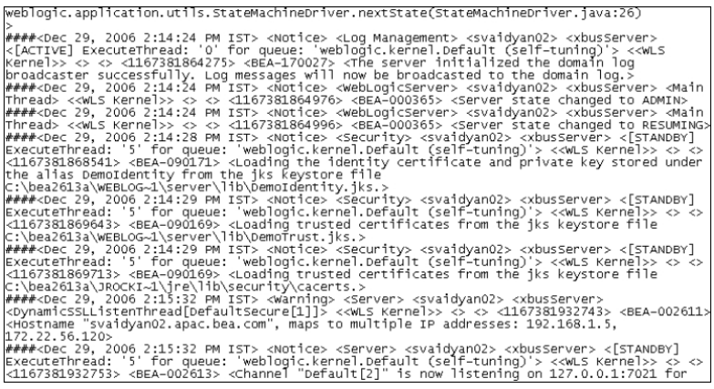

## System Architecture

There are three (3) main components of the Splunk System Architecture: **Forwarders**, **Indexers**, and **Search Heads**. Splunk Enterprise Forwarders and Indexers are software instances that perform specialized tasks, such as indexing and forwarding data to third-party systems. Several other components match these types of tasks in a deployment, falling into two broad categories: Processing and Management Components. Processing components handle data, while Management components support the activities of the processing components. There are three types of processing components:

1. Forwarders
2. Indexers
3. Search Heads

**Forwarders** ingest raw data and forward the data to another component, such as another Forwarder or an indexer.

**Indexers** index and store data, and they can also search data. They usually reside on a dedicated machine. They can be independent or in clusters (peer nodes or index clusters). A cluster is a physical grouping of machines in a particular region, such as Africa, Asia, or North America.

**Search Heads** are where Technical Analysts will likely spend most of their time. They handle search requests from users and distribute the requests across indexers, which search their local data. They can be independent or in a search cluster or pool. They help consolidate the results from all of the indexers and serve the results to the users. The search head provides users with dashboards, reports, and alerts that can be triggered at defined thresholds. They usually sit on dedicated servers as independent search heads, or they can be in an indexer cluster or a search head pool. Please refer to the following diagram that shows how the Search Head represents a small enterprise with less than 100 users.

## Understanding the underlying systems Splunk is monitoring

**What is Unstructured Data?** Unstructured data is data that is not organized into rows or columns. It is challenging to read, manipulate, and even harder to make sense of the dataset. This data typically consists of log files or event logs from a system or web server. The following image shows an example of unstructured data from a WebLogic server. When an error occurs, developers log in to the server and search through log files to find the reported error. 

These server logs can be large, difficult to read, and contain many other errors that we are not looking for but still need to review to ensure that it is not the error we are tracing. Large organizations have hundreds or thousands of servers, determined by the company and business type. Without Splunk, developers could spend days or weeks searching through files for errors. There are many tools available to help with debugging and searching through log files for traceability. Splunk solves this search problem by structuring our data into a readable format.

From the image above, it is really difficult to determine if there is a problem just by viewing the logs. We would need to closely examine all the output to identify a reported problem or copy the output to a different editor. Alternatively, we could copy the data to our local machine; however, this would be time-consuming because these files are large (i.e., 20-50GB) and would need to traverse the organization's network from the company server to your local machine. 

Now, imagine that we have one hundred (100) servers to manage, each with its own unique problem/error codes. This becomes a major problem that no one wants to deal with on a daily basis. This is one of the problems that Splunk solves by bringing structure to unstructured data.

**What is Structured Data?** Structured data is the opposite of unstructured data and presents a clearer picture for us to read, work with, and analyze. It can be presented in rows and columns (tables or tabular data) and typically originates from web servers or event logs. Taking a look at the screenshot below, you'll notice a field **status: 200**. This is a common field that indicates a webpage was returned to the user successfully. 

Other status codes like the 400/500 series show us which pages did not return successfully. We can easily read a lot of metadata about the request and response of the page using Splunk to identify problems quickly. Additionally, we could create dashboards to view failed requests over specific time periods or observe spikes in web traffic, CPU utilization, and memory usage. Taking this a step further, we can send notifications at defined thresholds for CPU, memory usage, response latency, and more.

{}
**Note**: HTTP/HTTPS response codes tell us if a particular request failed or was successful. This topic is outside of the scope of this book but should be reviewed at some point in your technical journey.   
{}

 

Here is the corrected content with grammar and punctuation improvements:

**Splunk Documentation** encompasses two main platforms under the Splunk umbrella: Splunk Enterprise and Splunk Cloud. The documentation you access will differ depending on the product you have installed. **Splunk Cloud** provides insights for data at the petabyte scale and offers data analytics across a hybrid cloud solution. **Splunk Enterprise** empowers us to search, analyze, and visualize data to derive actionable insights from all the data within the enterprise.

## Splunk Community

The [Splunk community](https://www.splunk.com/en_us/community.html) consists of three (3) parts: *Splunk Answers*, *Splunk User Groups*, and *Splunk Ideas*. **Splunk Answers** is a forum-style question-and-answer platform where we can read, post, and respond to questions. If we're working with search syntax and not achieving the expected results, Splunk Answers is the platform to find solutions and tap into the community of passionate experts.

**Splunk User Groups** allow us to connect with the super fans of the software, either online or in person. It's an environment where we can learn tips, tricks, and discover how others are using Splunk in their day-to-day business.

**Splunk Ideas** provide us with the option to search for ideas to improve the platform, vote on existing ideas, or submit new ideas for features and enhancements to the product. We can always leverage software communities to seek guidance and solutions to the problems we encounter. Remember that if you encounter a problem(s), there's likely someone else who has faced the same issue. The best place to start looking is the community.

